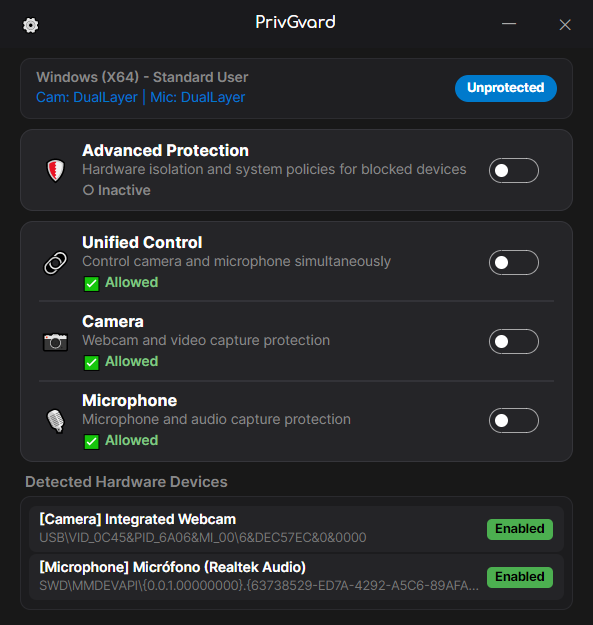

<p align="center">
  
  <h1 align="center">PrivGvard — Privacy Control for Camera &amp; Microphone</h1>
</p>

<p align="center">
  
  
  
  
  
  
</p>

**PrivGvard** is a desktop privacy application built with C# / .NET 10 and Avalonia UI that gives users transparent, reversible control over their camera and microphone.

PrivGvard follows the **Principle of Least Privilege**: it starts as a standard unprivileged user application (`asInvoker`), elevating privileges **strictly on-demand** for explicitly authorized operations via a transient, authenticated worker process.

> [!NOTE]
> **Platform Support Boundary:**
> - **Windows**: Primary supported platform featuring dual-layer policy and PnP hardware control, Core Audio capture mute lock, transactional Write-Ahead Log (WAL) recovery, and authenticated on-demand elevation.
> - **Linux & macOS**: Supported compilation targets and hardware discovery scaffolds (`CapabilityLevel.None`). Camera and microphone privacy mutations are not production-enabled on Linux or macOS until exact reversible state models and persistent recovery adapters are completed.

---

## 📸 Preview

<p align="center">
  
  <br />
  <em>PrivGvard main privacy controls.</em>
</p>

<table align="center" width="100%">
  <tr>
    <td align="center" width="50%" valign="top">
      <h4>Settings &amp; Diagnostics</h4>
      <!-- TODO screenshot:
           Save the current PrivGvard 2.0 Settings screenshot as:
           assets/screenshots/settings-window.png
      -->
      <em>Configuration, diagnostics and application preferences.</em>
    </td>
    <td align="center" width="50%" valign="top">
      <h4>System Tray Integration</h4>
      <!-- TODO screenshot:
           Save the current PrivGvard 2.0 System Tray screenshot as:
           assets/screenshots/system-tray.png
      -->
      <em>PrivGvard running discreetly in the Windows notification area.</em>
    </td>
  </tr>
</table>

---

## 📦 Releases & Downloads

<div align="center">

| Platform | Format | Architecture | Status / Purpose |
| :--- | :---: | :---: | :---: |
| 🪟 **Windows** | Setup Installer (`.exe`) / Portable (`.zip`) | `win-x64`, `win-arm64` | Full protection and recovery candidate |
| 🐧 **Linux** | Single-File Executable | `linux-x64` | Build/publish target; discovery scaffold only |
| 🍎 **macOS** | Single-File Executable | `osx-arm64` | Build/publish target; discovery scaffold only |

</div>

---

## ✨ Key Features

- 🛡️ **Capability-Aware Privacy Protection**:
  - **Windows**:
    1. *System Policy Layer*: captures and manages Windows `AppPrivacy` policies with exact value, type, and existence tracking.
    2. *PnP Hardware & Audio Layer*: toggles hardware device node states via `CfgMgr32.dll` and locks Core Audio capture endpoints.
    3. *Transactional Recovery*: commits state changes to a Write-Ahead Log (WAL) before mutation, restoring only session-owned changes on shutdown or restart.
  - **Linux & macOS**: Transparently exposes platform capabilities as read-only/scaffold, preventing false claims of protection.
- ⚡ **Single Binary & Dynamic On-Demand Elevation**:
  - Runs as an unprivileged process by default (`asInvoker`).
  - On Windows, privileged operations execute through a short-lived self-invocation (`PrivGvard.exe --privileged-worker`) with named-pipe IPC, 256-bit cryptographically random nonces, and parent-child PID verification.
  - No permanent elevated daemon and no secondary elevated executable.
- 🎨 **Modern Fluent Dark Interface**:
  - Avalonia UI 11 with custom title bar, rounded card styling, and responsive layout.
- 🌐 **Dynamic Multilingual Support (ES / EN)**:
  - Real-time language switching without restarting the application.
- ⌨️ **Global Keyboard Shortcut**:
  - Toggle quick protection at any time with **`Ctrl + Alt + B`**.
- 📌 **System Tray & Window Lifecycle**:
  - Closing the window (`X` or `Alt+F4`) hides the interface to the system tray while keeping protection active.
  - Tray context menu provides localized options to reopen the window or safely exit with complete journal restoration.
  - Native autostart support across platforms.

---

## 📐 Architecture & Project Structure

PrivGvard follows **Clean Architecture** with a clear separation of concerns:

```text
src/
├── PrivLock.Domain/                  # Pure C# domain models, capabilities, and value objects
├── PrivLock.Platform.Abstractions/   # Platform contracts (IDeviceProtectionProvider, IDeviceDetector, etc.)
├── PrivLock.Infrastructure.Common/   # Cross-platform JSON storage, Serilog logging, CrashReporter
├── PrivLock.Application/             # Orchestration services (ProtectionService, Settings, Localization)
├── PrivLock.Platform.Windows/        # Windows CfgMgr32 PnP, AppPrivacy policies, Core Audio, on-demand UAC
├── PrivLock.Platform.Linux/          # Linux V4L2 device discovery and experimental controller scaffold
├── PrivLock.Platform.MacOS/          # macOS CoreAudio HAL discovery and experimental controller scaffold
├── PrivLock.UI/                      # Multiplatform Avalonia UI 11 Views & ViewModels
└── PrivLock.Desktop/                 # Single executable host (produces PrivGvard.exe / PrivGvard)

tests/
├── PrivLock.Domain.Tests/            # Domain unit tests (cross-platform)
├── PrivLock.Infrastructure.Tests/    # Storage, crash reporting & localization tests (cross-platform)
├── PrivLock.Application.Tests/       # Orchestration & recovery tests (cross-platform)
└── PrivLock.Platform.Windows.Tests/  # Windows native PnP, registry, audio & IPC tests

legacy/                               # Quarantined archived PrivLock 1.x WPF codebase (build-guarded)
├── CamMicBlocker/
└── tests/CamMicBlocker.Tests/
```

---

## 💻 Building from Source

### Prerequisites
- [.NET 10 SDK](https://dotnet.microsoft.com/download/dotnet/10.0)

### 1. Clone & Build Solution
```powershell
git clone https://github.com/cristianbarreiro/PrivGvard.git
cd PrivGvard
dotnet build CamMicBlocker.sln
```

### 2. Run Active Test Suite
```powershell
# Run all tests on Windows:
dotnet test CamMicBlocker.sln

# See CI for current passing test count and cross-platform execution.
```

### 3. Run Application (Debug)
```powershell
dotnet run --project src/PrivLock.Desktop/PrivLock.Desktop.csproj
```

### 4. Publish Single-File Executables

```powershell
# Windows x64:
dotnet publish src/PrivLock.Desktop/PrivLock.Desktop.csproj -c Release -r win-x64 --self-contained -p:PublishSingleFile=true -o publish_out/win-x64

# Linux x64:
dotnet publish src/PrivLock.Desktop/PrivLock.Desktop.csproj -c Release -r linux-x64 --self-contained -p:PublishSingleFile=true -o publish_out/linux-x64

# macOS ARM64 (Apple Silicon):
dotnet publish src/PrivLock.Desktop/PrivLock.Desktop.csproj -c Release -r osx-arm64 --self-contained -p:PublishSingleFile=true -o publish_out/osx-arm64
```

---

## 🛡️ Security & Observability

- **Least Privilege Architecture**: Runs standard user permissions by default (`asInvoker`), elevating privileges transiently only during authorized operations.
- **Structured Diagnostic Logs**:
  - Windows: `%LOCALAPPDATA%\PrivGvard\Logs\PrivGvard-yyyyMMdd.log` (automatically migrates legacy `%LOCALAPPDATA%\PrivLock`).
  - Linux: `~/.local/share/PrivGvard/Logs/PrivGvard-yyyyMMdd.log`.
  - macOS: `~/Library/Application Support/PrivGvard/Logs/PrivGvard-yyyyMMdd.log`.
- **Post-Mortem Crash Reports**: Structured JSON reports generated in `.../PrivGvard/CrashReports/` on unhandled exceptions.
- **Fail-Secure Architecture**: The application never reports a device as protected without a fresh native effective-state verification (`EffectiveStatus`).

For detailed technical context, recovery validation, and architectural guidelines, see:
- [docs/ai/PROJECT_CONTEXT.md](docs/ai/PROJECT_CONTEXT.md) (Canonical OKF)
- [AGENTS.md](AGENTS.md) (Engineering and safety rules)
- [docs/ai/AUDIT-ROADMAP.md](docs/ai/AUDIT-ROADMAP.md) (Roadmap and audit findings)
- [docs/recovery-validation.md](docs/recovery-validation.md) (Recovery validation methodology)

---

## 📄 License

PrivGvard is free and open-source software released under the **GNU General Public License v3.0 (GPL-3.0)**.

```text
Copyright (C) 2026 Cristian Barreiro
Repository: https://github.com/cristianbarreiro/PrivGvard.git
```

For complete license terms, legal notices, and third-party dependency disclosures, see [LICENSE](LICENSE) and [COPYRIGHT](COPYRIGHT).
